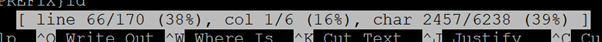
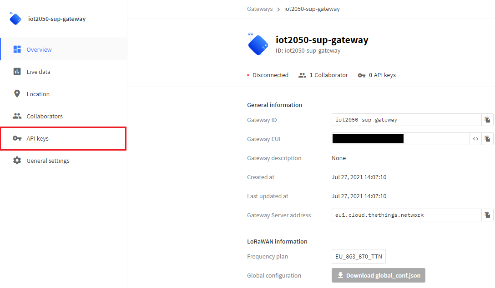

# **LoRa-based-IOT-Application**

- [**LoRa-based-IOT-Application**](#lora-based-iot-application)
  - [**Overview**](#overview)
  - [**Hardware**](#hardware)
    - [**LoRaWAN Gateway**](#lorawan-gateway)
      - [**Adapter Shield**](#adapter-shield)
      - [**Concentrator Module iC880A**](#concentrator-module-ic880a)
  - [**Software installation**](#software-installation)
    - [**Preparation of the IOT2050 Platform**](#preparation-of-the-iot2050-platform)
    - [**Enable the SPI-Interface on the IOT2050**](#enable-the-spi-interface-on-the-iot2050)
    - [**Clone LoRa Basics Station from Github**](#clone-lora-basics-station-from-github)
    - [**Adjustments to setup.gmk**](#adjustments-to-setupgmk)
    - [**Building the LoRa Basics Station**](#building-the-lora-basics-station)
    - [**LoRa Basics Station Configuration**](#lora-basics-station-configuration)
    - [**Create files for the authentication mode**](#create-files-for-the-authentication-mode)
    - [**Establish a trust relationship between gateway and server**](#establish-a-trust-relationship-between-gateway-and-server)
    - [**Resetting the iC880A module with the SX1301 baseband chip**](#resetting-the-ic880a-module-with-the-sx1301-baseband-chip)
    - [**Shell script to start Python script automatically**](#shell-script-to-start-python-script-automatically)
    - [**Find out the EUI**](#find-out-the-eui)
    - [**Add the gateway to The Things Stack Community Edition**](#add-the-gateway-to-the-things-stack-community-edition)
    - [**Autostart of the Basic Station on IOT2050**](#autostart-of-the-basic-station-on-iot2050)
    - [**Building an exemplary application**](#building-an-exemplary-application)
      - [**Adding end devices**](#adding-end-devices)
      - [**Visualization of end device data with Node-Red on the IOT2050**](#visualization-of-end-device-data-with-node-red-on-the-iot2050)
  - [**Contribution and Contribution License Agreement**](#contribution-and-contribution-license-agreement))
  - [**Licence and Legal Information**](#licence-and-legal-information)

## **Overview**

This IOT2050 application has the task of collecting data decentralized and transmitting it via radio. The LPWAN technology Long Range (LoRa) is used for this purpose. The IOT2050 serves as a LoRaWAN Gateway. The global, free LoRaWAN (Long Range Wide Area Network) from The Things Network or The Things Stack Community Edition is used as the network server. This manual describes the software and hardware structure of the gateway (the configuration and function of end devices (e.g sensors) is not explained in this manual, because it depends on the individual purpose of the application):

## **Hardware**

The following hardware components are required for the application:

- **SIMATIC IOT2050** as the LoRaWAN-Gateway
- **Adapter Shield** to integrate the iC880A Concentrator to the IOT2050 (self-build) and for the power supply of the concentrator
- **Concentrator Module iC880A** as a LoRaWAN Concentrator module
- **2 dBi Dipole Antenna 863-870MHz with RP SMA** (the selected antenna is based on the frequency range used in Europe from 863 to 870 MHz)
- **U.FL to reverse SMA adapter** as antenna cable

You can also see all individual parts in the [order list](docs/order_list_LoRa_gateway.xlsx).

### **LoRaWAN Gateway**

The Arduino Uno Interface of the SIMATIC IOT2050 is used to integrate the iC880A Concentrator. An adapter shield is required for this purpose, which combines the pin assignments. The concentrator is supplied with 5V.

#### **Adapter Shield**

The adapter shield used in this application was self-built. The required components can be taken from the [order list](docs/order_list_LoRa_gateway.xlsx). Further information about the structure can be found in [the project file (.pro)](docs/adapter%20shield/iC880A_shield_v1.2.pro), [the schematic file (.sch)](docs/adapter%20shield/iC880A_shield_v1.2.sch) and [the layout file (.kicad_pcb)](docs/adapter%20shield/iC880A_shield_v1.2.kicad_pcb).

#### **Concentrator Module iC880A**

The LoRaWAN Concentrator iC880A is a multi-channel high performance transmitter/receiver module designed to receive several LoRa packets simultaneously using different spreading factors on multiple channels. The concentrator module iC880A can be integrated into a gateway as a complete RF front end of this gateway.

The following figure shows the complete hardware structure of the LoRaWAN gateway. To connect the antenna (2 dBi Dipole Antenna 863-870MHz with RP SMA) to the iC880A module, a U.FL to reverse SMA adapter is used. The concentrator is plugged into the Arduino Uno interface of the IOT2050 together with the adapter shield.

## **Software installation**

The following software is used for this manual:

- **LoRa Basics™ Station** for an implementation of a LoRa® packet forwarder. A LoRa packet forwarder is a program running on the host of a LoRa-based gateway. It forwards RF packets received by the concentrator (uplinks) to a LoRaWAN® Network Server (LNS) through a secured IP link ([more information](https://doc.sm.tc/station/) - [Github Link](https://github.com/lorabasics/basicstation.git))
- **The LoRaWAN Network Server from The Things Industry** is at the core of every LoRaWAN Network that enables connectivity, management, and monitoring of devices, gateways and end-user applications. Its main objectives are to ensure the security, scalability and reliability of data routing throughout the network. (registration required! - [more information](https://www.thethingsindustries.com/news/what-lorawan-network-server/))
- **IOT2050 Example Image as of V1.1.1** as Linux operating system for the IOT2050. Can be downloaded [here](https://support.industry.siemens.com/cs/de/en/view/109780231)

### **Preparation of the IOT2050 Platform**
For the first commissioning of the IOT2050 please refer to the [Setting Up](https://github.com/SIMATICmeetsLinux/IOT2050-SmartFarming-Application/blob/main/docs/SIMATIC_IOT2050_setting_up.md). 
You can get further help in [the SIMATIC IOT2050 forum](https://support.industry.siemens.com/tf/ww/en/threads/309).

After working through the Setting Up, an update must be performed for the system and *git* must be installed. The following commands are executed for this:

    sudo apt-get update
    sudo apt-get upgrade
    sudo apt-get install git

### **Enable the SPI-Interface on the IOT2050**

Establish a shh connection via putty and use the following commands:

    iot2050setup
    Use the arrow keys: "Peripherals" -> "Configure Arduino I/O" -> "Enable SPI on IO10-IO13" -> "Enable"
    Use ESC to exit the iot2050setup

### **Clone LoRa Basics Station from Github**

To clone the latest version of LoRa Basics™ Station from Github use the following commands:

    cd /home
    git clone https://github.com/lorabasics/basicstation.git

### **Adjustments to setup.gmk**

Now the `setup.gmk` file, which is part of the clone, must be adapted for the IOT2050 to store the correct directories for the toolchain. To do this, open the file in an editor using the following commands:

    cd /home/basicstation/
    nano setup.gmk

With the key combination `CTRL+C` a line specification can be shown in the nano-editor:

Lines 55 - 66 must be commented out with `#` and lines 68 - 72 must be changed to the following:

    CC=/usr/bin/gcc
    LD=/usr/bin/ld
    AR=/usr/bin/ar
    OD=/usr/bin/objdump
    OC=/usr/bin/objcopy

In addition, line 76 must be edited as follows:

    export LD_LIBRARY_PATH=/usr/local/lib

Save and close the file with the following commands:

    CTRL+X -> to exit editing
    Y -> to save the changes
    Enter -> to confirm the filename

### **Building the LoRa Basics Station**

To build the package forwarder station use the following command in the directory `/home/basicstation/`:

    make platform=rpi variant=std

After the Basic Station has been compiled, a new folder called `build-rpi-std` with four subfolders has appeared. You can find the compiled binary `station` in the subfolder `bin`.

**Unless otherwise specified, the following commands and actions are always executed in this directory (`/home/basicstation/build-rpi-std/bin/`).**

### **LoRa Basics Station Configuration**

Some configurations are needed for the Basic Station, which are specified in the file `station.conf`. Copy the ready-made file [station.conf](src/station.conf) into the directory (Tip: The tool WINSCP can be used to transfer the files).

### **Create files for the authentication mode**

The LoRa Basics™ Station needs to be provided with the LoRaWAN® Network Server (LNS) to connect to. For this example The Things Stack Community Edition server with port 8887 is used. This is specified in the file `tc.uri`. Copy the ready-made file [tc.uri](src/tc.uri) into the directory.

### **Establish a trust relationship between gateway and server**

This requires a root certificate. The following command can be used to get a certificate and create the file `tc.trust` directly:

    curl https://letsencrypt.org/certs/isrgrootx1.pem.txt -o tc.trust

You can also use another root certificate, which needs to be inserted into the `tc.trust` file without the characters `<>`:

    -----BEGIN CERTIFICATE-----
    <insert root certificate here>
    -----END CERTIFICATE-----

### **Resetting the iC880A module with the SX1301 baseband chip**

The iC880A module with the SX1301 baseband chip must be reset every time it is switched on. However, this reset is not performed by the HAL of the chip. Therefor a Python script is written to carry that out externally. Copy the Python script [iC880A_Reset.py](src/iC880A_Reset.py) into the directory. Afterwards the Digital I/O PIN 4 must be set as output, because this is used as reset pin:

    iot2050setup
    Use the arrow keys: "Peripherals" -> "Configure Arduino I/O" -> "Enable GPIO" -> Set PIN 4 as output
    Use ESC to exit the iot2050setup

### **Shell script to start Python script automatically**

The next step is to add a shell script that executes the Python script. This script will later be executed with the start of the `station` binary. Copy the ready-made file [reset_gw.sh](src/reset_gw.sh) into the directory. In this shell script, the previously created Python script for the hardware reset of the concentrator is called. The script needs now to be provided with executable rights with the following command:

    chmod 755 reset_gw.sh

### **Find out the EUI**

To get the EUI of the gateway for registration at the server, the program `station` needs to be started once (execution is not fully functional yet):

    ./station

The EUI of the gateway is composed of the MAC address of the IOT2050 and is displayed in the console output after the station has been started:

The application can be stopped with the key combination `CTRL+C`.

### **Add the gateway to The Things Stack Community Edition**

Finally, to authorize the gateway with [The Things Stack Community Edition](https://eu1.cloud.thethings.network/console/gateways), an API key must be stored in a file called `tc.key`. To do this, the gateway must be registered at [The Things Stack Community Edition](https://eu1.cloud.thethings.network/console/gateways). This is explained in the following steps: After logging into the webpage, the region is selected. After that a new gateway can be added. For this, a unique gateway ID must be entered, as well as the gateway EUI from the previous figure. In addition, the frequency plan for the region is selected. Furthermore, it can be selected whether the status of the gateway is publicly visible. All required configurations are shown in the following figure:

After registering the new gateway, an API Key must be generated for authorization. Before the key is generated, it is assigned a name. In addition, it is given individual rights for linking as a gateway with a gateway server for data exchange. **After the creation of the API key it must be copied and stored urgently, because it is encrypted afterwards and therefore no longer visible.**

Use the following commands to build the `tc.key` file and use the previously copied API key instead of `xxx`:

    export LNS_KEY="xxx"
    echo "Authorization: Bearer $LNS_KEY" | perl -p -e 's/\r\n|\n|\r/\r\n/g' > tc.key

This completes the installation and configuration of the Basic Station. Now the the station can be started manually with the command:

    ./station

If the installation and authentication are successful, the station starts and the gateway is displayed as `connected` in the console of The Things Stack Community Edition:

You can receive further information on the [The Things Stack Website - Adding Gateways](https://www.thethingsindustries.com/docs/gateways/adding-gateways/).

### **Autostart of the Basic Station on IOT2050**

Copy the ready-made shell script [start.sh](src/start.sh), which call the `station` binary, into the directory. The script must then be provided with executable rights:

    chmod 755 start.sh

Copy the ready-made systemd service file [iot-2050-lora-gateway.service](src/iot2050-lora-gateway.service) into the directory `/etc/systemd/system`. To change to that directory use the following command:

    cd /etc/systemd/system

The service file can now be started manually and tested with the following command:

    sudo systemctl start iot2050-lora-gateway.service

After successful start of the service and the station, it can be terminated with the following command:

    sudo systemctl stop iot2050-lora-gateway.service

To enable the autostart of the service use the command

    sudo systemctl enable iot2050-lora-gateway.service

After the next reboot, the gateway will be started with every boot.

### **Building an exemplary application**

#### **Adding end devices**

The gateway is now ready for use. End devices can now be added to the application via The Things Stack Community Edition, which then transmit data via the gateway to the server. [Here you can find some possible end devices.](https://www.thethingsnetwork.org/marketplace/products/devices) How to add end devices on the server is described [here](https://www.thethingsindustries.com/docs/devices/adding-devices/)

#### **Visualization of end device data with Node-Red on the IOT2050**

Node-Red is used to visualize the collected data. The web editor is accessible via the IP address of the IOT2050 and port 1880. Node-red is in autostart by default on the Example Image. To access it, open a browser on your PC connected to the IOT2050 and open the URL `http://<IP of the IOT2050>:1880/`.

Now the [flows.json](src/flows.json) file can be imported into Node-Red:

    Menu -> Import -> Select file for Upload

The nodes must be adjusted as follows:

**MQTT:** Insert the server address and the port of The Things Stack in the connection tab.  To subscribe all messages set *Topic* to `#`.

Enter your *Username* and the *MQTT-API-Key* as the *Password*. You can generate this API-Key in the integrations-settings of your application:

**Parse Node:** In the function *Parse Node* the different `device_id` must be adjusted (depending on the application):

**Description of the flow:** To process the incoming messages, a Javascript object is created first. Then the uplinks are parsed in the function *Parse Node* to extract the individual messages of each end device. In addition, the node is extended to three outputs. Thus, each message is assigned to an output and stands for an end device. Using the dashboard library and the gauge node, these can then be individually built into a dashboard.

The pre-build flow shows an example of the combination of three end devices in the parse node. The ID's must be adjusted depending on the application and the setting in The Things Network.

**Dashboard:** To display the data, the Dashboard palette can now be installed and individually configured:

    Menu -> Manage Palette -> Install Tab -> Search and install the given libraries

- node-red-dashboard

**Completion:** To download the flow to the IOT2050 click on the button `Deploy`

To open the dashboard of node-red open the URL `http://<IP of the IOT2050>:1880/ui`

## **Contribution and Contribution License Agreement**

Thanks for your interest in contributing. Anybody is free to report bugs, unclear documenation, and other problems regarding this repository in the Issues section or, even better, is free to propose any changes to this repository using Merge Requests.  For more information please check the [Contribution License Agreement](docs/Siemens_CLA.pdf).

## **Licence and Legal Information**

Please read the [Legal information](LICENSE.md).
